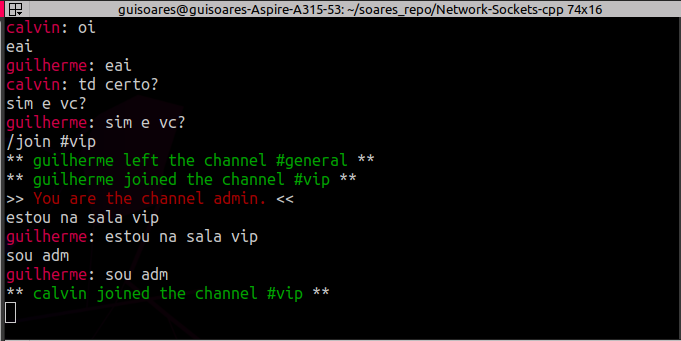

# **Golden Chat** - an Internet Relay Chat

## Demonstração 
<p align="center">
  <a href="https://youtu.be/9MnSZydcIG8" title="Link Title"></a>
</p>


## Membros
- Caio Brandolim Rovetta     | N USP:11232156
- Calvin Suzuki de Camargo   | N USP:11232420
- Guilherme Soares Silvestre | N USP:11299832
## Descrição
A aplicação foi projetada e testada em máquinas operando com o Ubuntu 20.04 e Manjaro. Para a compilação foram utilizadas as configurações no MakeFile, o qual usa o G++.
## Como compilar?
Configuramos o ``Makefile`` para facilitar a compilação dos arquivos, que no momento, envolvem somente dois documentos ``*.cpp`` : ``server.cpp`` e ``client.cpp``.

Para compilar e executar o Servidor: 

```bash
make sv
```

Abra outro terminal, compile e execute o cliente:

```bash
make client
```
## Funcionamento do programa

O Golden Chat é uma aplicação no modelo cliente-servidor. O servidor centraliza todas as conexões com os clientes, organizando a hierarquia de administradores, configurações de clientes e troca de mensagens.

O servidor apresenta um log, aonde é possível analisar tudo o que acontece nele. A interface do cliente é mais amigável e apresenta informações do canal que o usuário pertence. Essas informações são, aviso de entrada de novo usuário, ações do administrador de mudo/não mudo e banimento. 

Por fim, testamos o servidor configurado com DMZ recebendo clientes remotos (outras máquinas acessando pelo IP Global) e funcionou muito bem! Seguem alguns prints da interface, espero que aproveite!





